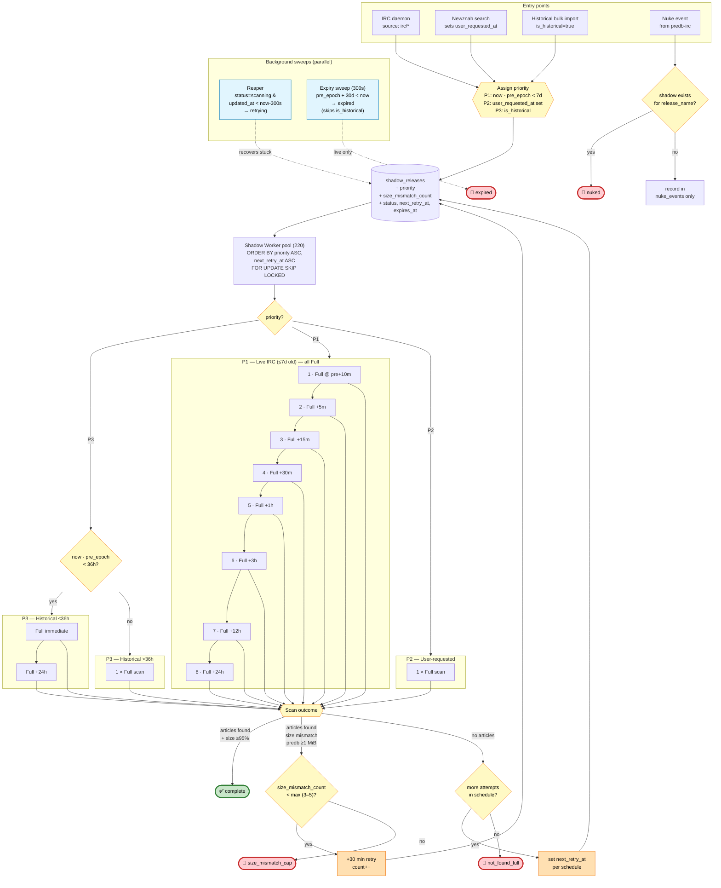

# Shadow Scan Logic

Retry/backoff state machine for the nzb-mirror shadow worker. Priority-based scheduling with graduated backoff for live pre-db, one-shot scans for user-requested and historical entries.

## Priority model

| Priority | Source | Schedule |
|----------|--------|----------|
| **P1** | Live IRC (`now - pre_epoch < 7d`) | 8 full scans graduated over ~43h |
| **P2** | User-requested (Newznab search) | Single full scan |
| **P3 (≤36h)** | Historical, recent | Full immediate + full +24h |
| **P3 (>36h)** | Historical, older | Single full scan |

All scans are Full. The Quick variant (capped group set) is removed — P1's first attempt is a Full at `pre_epoch + 10m`.

## Reaper semantics

When a row stuck in `scanning` is reaped, `scan_attempts` is **decremented** (not just status reset). A crash mid-scan should not consume a schedule slot — the same step gets re-attempted on the next claim.

## Schema additions required

```sql
ALTER TABLE shadow_releases ADD COLUMN priority smallint NOT NULL DEFAULT 3;
ALTER TABLE shadow_releases ADD COLUMN size_mismatch_count smallint NOT NULL DEFAULT 0;
CREATE INDEX idx_shadow_releases_queue
  ON shadow_releases (priority, next_retry_at)
  WHERE status IN ('pending', 'retrying');
```

## State machine



## Terminal states

| State | Cause |
|-------|-------|
| `complete` | Articles found, size match ≥95% — release row created |
| `nuked` | Nuke event received from predb-irc |
| `expired` | `pre_epoch + 30d < now` (live shadows only) |
| `not_found_full` | Schedule exhausted without finding articles |
| `size_mismatch_cap` | Found articles but size wrong N times (3–5) — likely wrong variant |

## Config replacement

These knobs become obsolete under the new model:

| Current | Status |
|---------|--------|
| `max_scan_attempts_cap = 5` | Removed — replaced by priority-specific schedules |
| `full_after_quick_failures = 3` | Removed — P1 does 1 quick then all fulls |
| `no_match_retry_secs = 21600` | Removed — replaced by graduated backoff |

These stay:

| Knob | Purpose |
|------|---------|
| `pre_age_min_secs = 600` | Propagation wait before first scan |
| `size_match_floor = 0.95` | Size agreement threshold |
| `size_check_min_predb_bytes = 1048576` | Skip size check for <1 MiB items |
| `size_short_retry_secs = 1800` | Size-mismatch retry interval |
| `stuck_scan_after_secs = 300` | Reaper threshold |
| `expiry_sweep_secs = 300` | Expiry sweep cadence |
| `worker_concurrency = 220` | Worker pool size |
